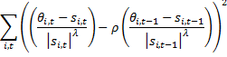
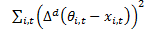
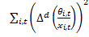
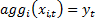
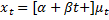
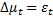
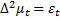
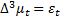
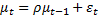
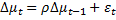

# Benchmarking
## Overview
The benchmarking problem can be described as follows:
For a given series x(t), find θ(t) that preserve « as much as possible » the movements of the original series and that fulfil given aggregation constraints
The benchmarking methods need the time series of the constraints (low-frequency), the original series (high-frequency) and some parameters that describe the underlying optimization problem. To be noted that the high-frequency series can be omitted; the problem is then a pure interpolation problem.
The aggregation constraints can be defined following different ways: by sum, by average or taking the first or the last observation (respectively `Sum, Average, First, Last` in `TsAggregationType`).

JDemetra-ws provides the following methods:
-  Cholette
-  Denton (standard and SSf implementations)
-  Expander (pure interpolation method)

#### Bibliography

DAGUM, B.E. and CHOLETTE P.A. (2006): “Benchmarking, Temporal Distribution, and Reconciliation Methods for Time Series”, Springer.

PALATE J. (2005): ‘Reusable Components for Benchmarking Using Kalman Filters”, working papers and studies, European Communities.

## /benchmarking/cholette 

#### Description

The Cholette method minimizes the following objective function

#### WEB API

-   Consumes : `application/xml`, `application/json`
-   Produces : `application/xml`, `application/json`
-   Return type : `XmlTsData`

_Input: JsonCholetteProcessing (POST object)_

| Attribute | Type              | Description                       | Required |     Default Value     |
|-----------|-------------------|-----------------------------------|:--------:|:---------------------:|
| x         | XmlTsData         | First time series                 |   true   |                       |
| y         | XmlTsData         | Second time series                |   true   |                       |
| rho       | Double            | Auto-regressive factor (in [-1, 1]|          |           1           |
| lambda    | Double            |                                   |          |           1           |
| bias      | String            | (see TsCholette.BiasCorrection)   |          |         "None"        |
| agg       | TsAggregationType | Aggregation type                  |          | TsAggregationType.Sum |

## /benchmarking/denton

#### Description

The Denton method minimizes the following objective functions
-   Additive:   
-   Multiplicative:    

under the constraint that 

, 

where agg defines the aggregation function (see above).
It should be noted that the additive case is well-defined even if x(i,t) is omitted

#### WEB API

-   Consumes : `application/xml`, `application/json`
-   Produces : `application/xml`, `application/json`
-   Return type : `XmlTsData`

_Input: JsonDentonProcessing (POST object)_

| Attribute        | Type              | Description            | Required |     Default Value     |
|------------------|-------------------|------------------------|:--------:|:---------------------:|
| x                | XmlTsData         | First time series      |          |                       |
| y                | XmlTsData         | Second time series     |   true   |                       |
| mul              | Boolean           |                        |          |          true         |
| modified         | Boolean           |                        |          |          true         |
| differencing     | Integer           | d (see formulae)       |          |           1           |
| agg              | TsAggregationType | Aggregation type       |          | TsAggregationType.Sum |
| defaultFrequency | Integer           | Default frequency      |          |           0           |

Remarks:
-   The 'modified' option should always be true, except for legacy calls. See Dagum, Cholette (2006) for detailed explanations. 
-   The differencing order (d) should not exceed 3, for stability issues. 
-   The default frequency (optional) is used only when x is missing; the user has then to provide the frequency of the interpolated series; it should be a multiple of the frequency of the constraints (y); 

## /benchmarking/ssfdenton

#### Description

State space version of the Denton's method. It corresponds to the usual method with 'modified' set to 'true' and 'differencing' set to 1. This version is much more efficient in case of very long series.

#### WEB API

-   Consumes : `application/xml`, `application/json`
-   Produces : `application/xml`, `application/json`
-   Return type : `XmlTsData`

_Input: JsonSsfDentonProcessing (POST object)_

| Attribute | Type              | Description        | Required |     Default Value     |
|-----------|-------------------|--------------------|:--------:|:---------------------:|
| x         | XmlTsData         | First time series  |   true   |                       |
| y         | XmlTsData         | Second time series |   true   |                       |
| mul       | Boolean           |                    |          |          true         |
| agg       | TsAggregationType | Aggregation type   |          | TsAggregationType.Sum |

## /benchmarking/expander

#### Description

The expander interpolates a given low-frequency time series by a high-frequency time series that follows a given model. More explicitly, we consider the following model:

where μ(t) is defined by the possible stochastic models:

|Id     | Model       |
|-------|-------------|
|I1     ||
|I2     ||
|I3     ||
|AR1    ||
|I1AR1  ||

#### WEB API

-   Consumes : `application/xml`, `application/json`
-   Produces : `application/xml`, `application/json`
-   Return type : `XmlTsData`

_Input: JsonExpanderProcessing (POST object)_

| Attribute        | Type              | Description                                      | Required |     Default Value     |
|------------------|-------------------|--------------------------------------------------|:--------:|:---------------------:|
| y                | XmlTsData         | Second time series                               |   true   |                       |
| defaultFrequency | Integer           | Default frequency. Used only when domain is null |          |                       |
| domain           | XmlTsDomain       | Domain used by expander                          |          |                       |
| useparam         | Boolean           |                                                  |          |         false         |
| parameter        | Double            |                                                  |          |          0.9          |
| trend            | Boolean           |                                                  |          |         false         |
| constant         | Boolean           |                                                  |          |         false         |
| model            | String            | ( see description)                               |          |          "I1"         |
| agg              | TsAggregationType | Aggregation type                                 |          | TsAggregationType.Sum |

Remarks
-   When `useparam` is set to `true`, the given parameter (corresponding to rho) is used in the model. Otherwise, the parameter is estimated by maximum likelihood (and the given value is used as starting value).
-   Some combinations are not possible: if the differencing order is higher or equal to 1, the constant is not taken into account; if the differencing order is higher or equal to 2, the trend is not taken into account.

