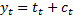
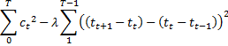

# Other time series methods

## /hodrickprescott

#### Description

The Hodrick-Prescott filter decompose a series into a trend and a cycle components

The components minimize the following objective function

The implementation in JDemetra-ws allows the decomposition of a series or of its trend/seasonally adjusted component.
The lambda coefficient, which determines the signal to noise ratio, can be provided or automatically computed (by using the annual frequency of the series and by considering that
the length of a cycle is 8 years on average or by specifying the length of a cycle).

#### WEB API

-   Consumes : `application/xml`, `application/json`
-   Produces : `application/json`
-   Return type : `Map<String, XmlTsData>`

_Input:_

| Parameter | Type      | Description                            | Required | Default Value |
|-----------|-----------|----------------------------------------|:--------:|:-------------:|
| tsData    | XmlTsData | The initial time series                |   true   |               |
| method    | String    | The sa routine (tramoseats, X13, none) |          |  "TramoSeats" |
| spec      | String    | Specification used (depending on the method. see the SA algorithms) |          |     "RSA4"    |
| target    | String    | The decomposed series (original, sa, trend)           |          |      "sa"     |
| deflambda | Boolean   | If true, uses the default lambda value |          |      true     |
| lambda    | Double    | Lambda value                           |          |      1600     |
| mul       | Boolean   | Multiplicative decomposition (computed on the logs) or additive decomposition |          |     false     |
| lcycle    | Double    | Length of a cycle (in years)           |          |       0       |

Remarks:

- When the length of a cycle (lcycle) is specified (>0), lambda is unused.
- If the target is "original", the sa routine is unused

_Output:_

The results contains the following elements

| key | Description |
|-----|-------------|
|"series"|The decomposed series|
|"trend"|The trend component|
|"cycle"|The cycle component|
